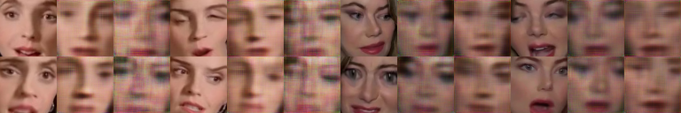
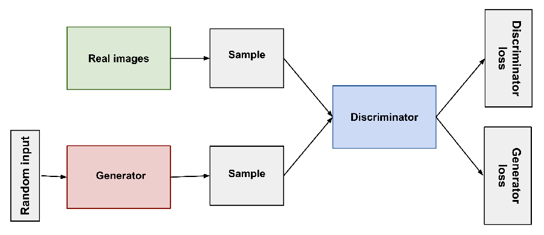
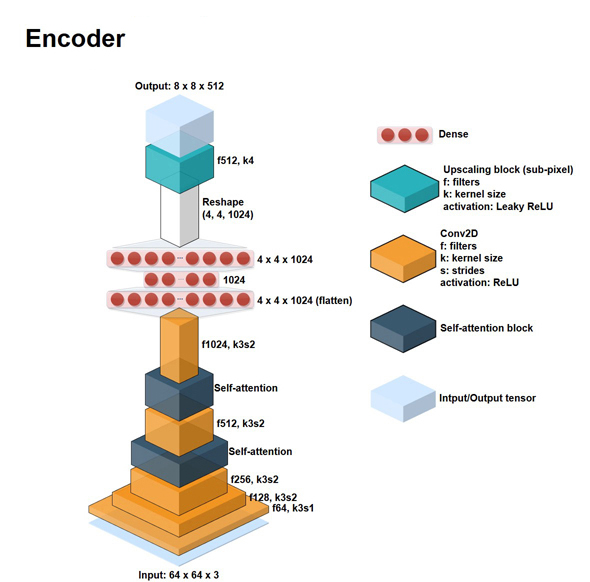
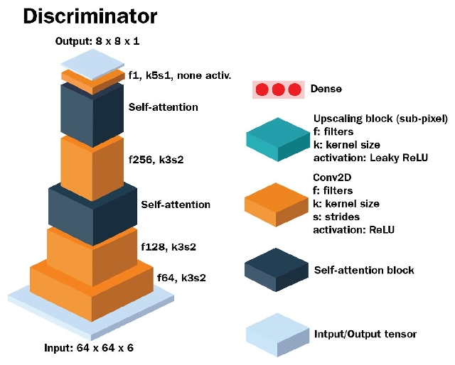

# Генеративно-состязательная нейросеть (GAN) для подмены лиц
Добавление состязательных и перцептуальных (VGGface) функций потерь в архитектуру автоэнкодера дипфейков.

### Общее описание нейросети
Алгоритм классического машинного обучения без учителя. 
Суть идеи состоит в комбинации двух нейросетей, при которой одновременно работает два алгоритма 
“генератор” и “дискриминатор”.

**Дискриминатор**. 
Для распознавания используются сверточные нейронные сети (CNN). Задача дискриминатора – пытаться распознать созданный 
образ и определить ложная ли она.

**Генератор**.
Формирование изображений начинается с генерации произвольного шума, на котором постепенно начинают 
проступать фрагменты искомого изображения.
Задача генератора – генерировать образы заданной категории.

Таким образом эти две имеют состязательные отношени, при котором генератор во время обучения пытается
сгенерировать реалистичные ложные данные для замены лица таким образом, чтобы дискриминативная сеть не
смогла бы разпознать подмену лица. Таким образом обе сети тренируют друг друга до состояния 
оптимального равновесия, при котором генератор будет сгенерировать неотличимые от реальных данные, а 
дискриминатор более точно подтвердить ложность или истинность полученных данных.

Ниже представлен один из этапов процесса [обучения](docs/train.md) GAN нейросети для подмены лиц при 7200 итерациях обучения:

- Для простого обучения вполне достаточно иметь 2 видео исходного и целевого лиц, а дальше алгоритмы определят
лица в видео ([FaceNet](https://github.com/davidsandberg/facenet)) и оптимально извлекать кадры с лицом, по этой причине в кадре необходимо присутствие только
и только одного лица.
- Для лучших результатов подмены лица, количество итераций должно быть не меньше 18'000.

### Архитектура сети
  
  
  
  
  
  
  

### Результаты применения подхода
- **Улучшенное качество вывода:** Функция состязательных потерь улучшает качество реконструкции сгенерированных изображений.

### Особенности
- **[VGGFace](https://github.com/rcmalli/keras-vggface) perceptual loss:** Функция перцептуальных потерь улучшает 
направление глазных яблок, чтобы дыть более реалистичный и соответствовующий входному лицу выходной. 
Это также сглаживает артефакты в маске сегментации, что приводит к повышению качества вывода.

- **`Attention mask`:** Модель предсказывает `attention mask`, которая помогает справиться с окклюзией, устраняя 
артефакты и создавая естественный тон кожи.

- **Отслеживание/выравнивание лиц с использованием MTCNN и фильтра Калмана при преобразовании видео**: 
  - Используется сеть MTCNN для более стабильного обнаружения и надежного выравнивания лица.
  - Фильтр Калмана сглаживает положение ограничивающей рамки (bounding) на кадрах и устраняет дрожание на заменяемом лице.
  - 
  
- **Обучение с учетом глаз:** Использование высоких значений `reconstruction loss` и `edge loss` в области глаз позволяет модели создавать реалистичные глаза.

## Замена частей лица
  - Заменить только часть исходного лица (рот/нос/глаза) на целевое лицо, обрабатывая замененное лицо как расширенные 
обучающие данные для исходного лица.
  - Для каждого исходного изображения лица аналогичное целевое лицо извлекается с помощью knn 
(с использованием усредненной карты объектов в качестве входных данных) для замены частей лица.
  - Результаты: Модель также учится генерировать артефакты, которые появляются в дополненных данных, 
например, острые края вокруг глаз/носа и странно искаженное лицо.
  - Артефакты дополненных данных вызваны несовершенным смешиванием (из-за ложных ориентиров и плохого perspective warping).

  - 

## Google Colab

[FaceswapGAN train](https://colab.research.google.com/github/alvinahmadov/faceswap-parts/blob/main/colab/faceswap-demo.ipynb) для faceswap на Google Colab. 

Пользователи могут обучать свою собственную модель в браузере.
* [faceswap_train.ipynb](https://github.com/alvinahmadov/faceswap-parts/blob/main/colab/faceswap_train.ipynb)
  - Блокнот для обучения FaceswapGAN модели.
  - Требуются дополнительные обучающие изображения, созданные с помощью [prep_binary_masks.ipynb](https://github.com/alvinahmadov/faceswap-parts/blob/main/prep_binary_masks.ipynb).
  
* [faceswap_video_conversion.ipynb](https://github.com/alvinahmadov/faceswap-parts/blob/main/colab/faceswap_video_conversion.ipynb)
  - Ноутбук для преобразования видео FaceswapGAN модели.
  - Выравнивание лица с использованием 5-точечных ориентиров используется в преобразовании видео.
  
* [prep_binary_masks.ipynb](https://github.com/alvinahmadov/faceswap-parts/blob/main/colab/prep_binary_masks.ipynb)
  - Ноутбук для предварительной обработки обучающих данных. Выходные двоичные маски сохраняются в `{dir}/binary_masks/face_src_eyes` и `{dir}/binary_masks/face_dst_eyes`.
  - Требуется пакет [face_alignment](https://github.com/1adrianb/face-alignment). 
(Альтернативный метод для генерации бинарных масок без требования библиотек `face_alignment` и `dlib`, находятся в [video_face_detection_alignment.ipynb](https://github.com/alvinahmadov/faceswap-parts/blob/main/video_face_detection_alignment.ipynb).) 
  
* [video_face_detection_alignment.ipynb](https://github.com/alvinahmadov/faceswap-parts/blob/main/colab/video_face_detection_alignment.ipynb)
  - Этот ноутбук выполняет распознавание/выравнивание лиц на входном видео.
  - Обнаруженные лица сохраняются в `{dir}/faces/raw_faces` и `{dir}/faces/aligned_faces` для выровненных и без результатов соответственно.
  - Двоичные маски глаз также генерируются и сохраняются в `{dir}/faces/binary_masks_eyes`. Эти двоичные маски могут служить субоптимальной альтернативой маскам, созданным с помощью [prep_binary_masks.ipynb](https://github.com/alvinahmadov/faceswap-parts/blob/main/colab/prep_binary_masks.ipynb). 
  
### Прочее

**Как использовать?**

Выполняйте [faceswap-demo.ipynb](https://github.com/alvinahmadov/faceswap-parts/blob/main/colab_demo/faceswap-demo.ipynb) для реализации всех этапов FaceSwap в одном ноутбуке (в Google Colab).

_**Примечание:**_ Для хранения обучаемых данных рекомендуется использовать Google Drive или Google Storage. В ноутбуке есть необходимые инструкции.

Вышеописанный ноутбук состоит из ячеек, взятых из следующих ноутбуков:
- [video_face_detection_alignment.ipynb](https://github.com/alvinahmadov/faceswap-parts/blob/main/colab/video_face_detection_alignment.ipynb) для извлечения лиц из видео. 
- [prep_binary_masks.ipynb](https://github.com/alvinahmadov/faceswap-parts/blob/main/colab/prep_binary_masks.ipynb) для создания двоичных масок обучающих изображений.
- [faceswap_train.ipynb](https://github.com/alvinahmadov/faceswap-parts/blob/main/colab/faceswap_train.ipynb) для обучения моделей.
- [faceswap_video_conversion.ipynb](https://github.com/alvinahmadov/faceswap-parts/blob/main/colab/faceswap_video_conversion.ipynb) для создания видео с использованием обученных моделей.

**Примечание:** *Только для ознакомительных целей*.
 

### Формат обучающих данных
  - Face images are supposed to be in `{dir}/face_src/` or `{dir}/face_dst/` folder for source and target respectively. 
  - Изображения лиц должны находиться в папке `{dir}/face_src/` или `{dir}/face_dst/` для исходного и целевого лиц соответственно.
  - Во время обучения размер изображений будет изменен до 256x256.

## Ссылки на используемые алгоритмы
### Алгоритмы
- [GANotebooks](https://github.com/tjwei/GANotebooks)
- [Keras-GAN](https://github.com/eriklindernoren/Keras-GAN/blob/master/aae/aae.py)
- [deep-learning-with-python-notebooks](https://github.com/fchollet/deep-learning-with-python-notebooks/blob/master/chapter12_part05_gans.ipynb "The GAN")
- [SAGAN](https://github.com/taki0112/Self-Attention-GAN-Tensorflow)
- [PixelShuffler layer for Keras by t-ae](https://github.com/t-ae/watch-generator-keras/blob/master/custom_layers.py)
- [keras-contrib](https://github.com/keras-team/keras-contrib/blob/master/examples/improved_wgan.py) 
- [CycleGAN](https://github.com/junyanz/pytorch-CycleGAN-and-pix2pix)
- [FaceNet](https://github.com/davidsandberg/facenet)
- [cnn_finetune](https://github.com/flyyufelix/cnn_finetune/blob/master/custom_layers/scale_layer.py)
- [ICNR](https://github.com/kostyaev/ICNR)
- [reddit user deepfakes' project](https://pastebin.com/hYaLNg1T)

### Библиотека
- Jun Fu et al. - [Dual Attention Network for Scene Segmentation](https://arxiv.org/pdf/1809.02983.pdf)
- Han Zhang, Ian Goodfellow, Dimitris Metaxas, Augustus Odena - [Self-Attention Generative Adversarial Network (SAGAN)](https://arxiv.org/pdf/1805.08318.pdf)
- Taesung Park, Ming-Yu Liu, Ting-Chun Wang, Jun-Yan Zhu - [Semantic Image Synthesis with Spatially-Adaptive Normalization (SPADE)](https://arxiv.org/abs/1903.07291)
- Jimmy Lei Ba, Jamie Ryan Kiros, Geoffrey E. Hinton - [Layer Normalization](https://arxiv.org/abs/1607.06450)
- Dmitry Ulyanov, Andrea Vedaldi, Victor Lempitsky - [Instance Normalization: The Missing Ingredient for Fast Stylization](https://arxiv.org/abs/1607.08022)