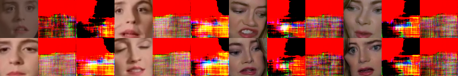
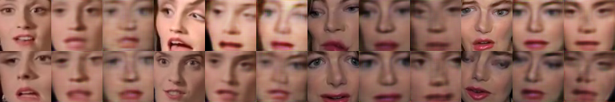
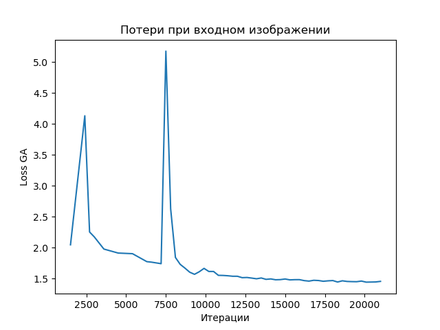
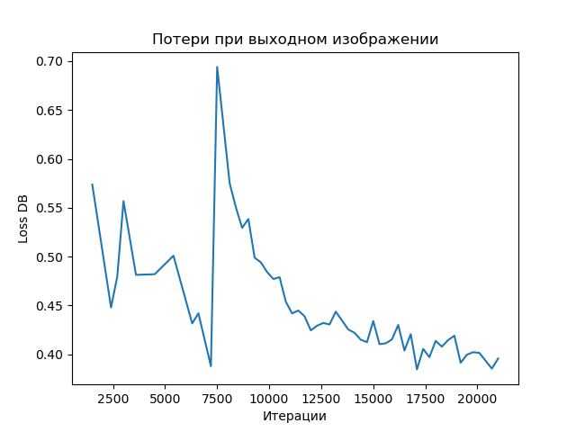
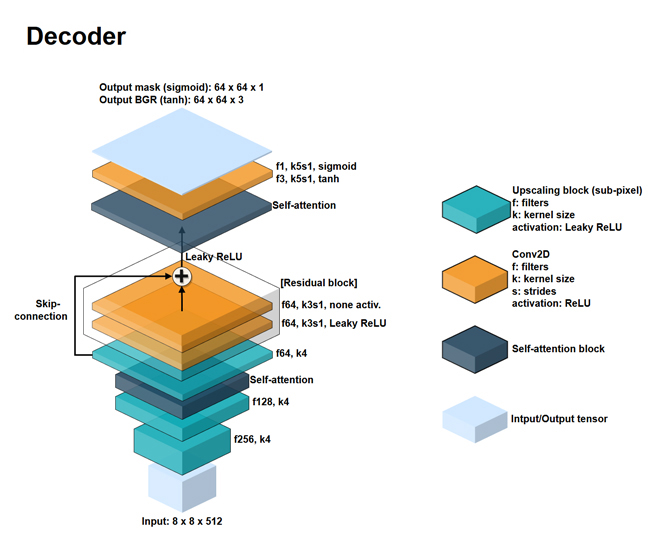

# Generative Adversarial Network (GAN) for Face Swapping

Adding adversarial and perceptual (VGGface) loss functions to the deepfake autoencoder architecture.

### General Network Description

An unsupervised machine learning algorithm. The core idea consists of combining two neural networks, where two algorithms work simultaneously: the "generator" and the "discriminator".

**Discriminator**. Convolutional Neural Networks (CNN) are used for recognition. The discriminator's task is to attempt to recognize the generated image and determine whether it is fake.

**Generator**. Image generation begins with generating random noise, on which fragments of the desired image gradually begin to appear. The generator's task is to generate images of a given category.

Thus, these two networks have an adversarial relationship, where the generator during training attempts to generate realistic fake data for face replacement in such a way that the discriminative network cannot recognize the face swap. In this way, both networks train each other until an optimal equilibrium is reached, where the generator will generate data indistinguishable from real data, and the discriminator will more accurately confirm the falsity or authenticity of the received data.

#### Training

- For simple training, it is sufficient to have 2 videos of source and target faces, and then algorithms will detect faces in the video ([FaceNet](https://github.com/davidsandberg/facenet)) and optimally extract frames with faces. For this reason, only one face should be present in the frame.
- For better face swap results, the number of iterations should be at least 18,000.

_Below is one of the stages of the [training](docs/train.md) process of the GAN network for face swapping at various training iterations_:

**7200**


**7500**



**21k**



Loss graphs:






### Network Architecture





### Results of the Approach

- **Improved Output Quality:** The adversarial loss function improves the reconstruction quality of generated images.

### Features

- **[VGGFace](https://github.com/rcmalli/keras-vggface) perceptual loss:** The perceptual loss function improves eyeball direction to produce more realistic output that matches the input face. It also smooths artifacts in the segmentation mask, resulting in improved output quality.

- **`Attention mask`:** The model predicts an `attention mask` that helps handle occlusion by eliminating artifacts and creating natural skin tone.

- **Face tracking/alignment using MTCNN and Kalman filter for video conversion**:
  - MTCNN network is used for more stable face detection and reliable face alignment.
  - Kalman filter smooths the bounding box position across frames and eliminates jitter on the swapped face.
  - 

- **Eye-aware training:** Using high values of `reconstruction loss` and `edge loss` in the eye region allows the model to create realistic eyes.

## Face Parts Replacement

#### Method #1

- Replace only part of the source face (mouth/nose/eyes) with the target face, treating the swapped face as augmented training data for the source face.
- For each source face image, a similar target face is extracted using knn (using averaged feature maps as input) for face parts replacement.
- Disadvantages:
  - The model also learns to generate artifacts that appear in the augmented data, such as sharp edges around the eyes/nose and strangely distorted faces.
  - Artifacts in augmented data are caused by imperfect blending (due to false landmarks and poor perspective warping).
  - Training must be performed for each face part separately.

- 

#### Method #2

- During face transformation, we search for face part landmarks on the frame using the `face-alignment` library on the source face;
- We perform `convex hull` to expand the found points into a thick line;
- We trace the contours of the obtained `convex hull`
- 
- To remove unwanted face parts, leaving only the needed ones, we combine the source face with the binary mask of the source face;
- 
- We perform masking again and then face replacement occurs.
- 

## Google Colab

[FaceswapGAN train](https://colab.research.google.com/github/alvinahmadov/faceswap-parts/blob/main/colab/faceswap-demo.ipynb) for faceswap on Google Colab.

Users can train their own model in the browser.

- [faceswap_train.ipynb](https://github.com/alvinahmadov/faceswap-parts/blob/main/colab/faceswap_train.ipynb)
  - Notebook for training FaceswapGAN model.
  - Requires additional training images created using [prep_binary_masks.ipynb](https://github.com/alvinahmadov/faceswap-parts/blob/main/prep_binary_masks.ipynb).

- [faceswap_video_conversion.ipynb](https://github.com/alvinahmadov/faceswap-parts/blob/main/colab/faceswap_video_conversion.ipynb)
  - Notebook for FaceswapGAN model video conversion.
  - Face alignment using 5-point landmarks is used in video conversion.

- [prep_binary_masks.ipynb](https://github.com/alvinahmadov/faceswap-parts/blob/main/colab/prep_binary_masks.ipynb)
  - Notebook for preprocessing training data. Output binary masks are saved in `{dir}/binary_masks/face_src_eyes` and `{dir}/binary_masks/face_dst_eyes`.
  - Requires [face_alignment](https://github.com/1adrianb/face-alignment) package. An alternative method for generating binary masks without requiring `face_alignment` and `dlib` libraries can be found in [video_face_detection_alignment.ipynb](https://github.com/alvinahmadov/faceswap-parts/blob/main/video_face_detection_alignment.ipynb).

- [video_face_detection_alignment.ipynb](https://github.com/alvinahmadov/faceswap-parts/blob/main/colab/video_face_detection_alignment.ipynb)
  - This notebook performs face detection/alignment on input video.
  - Detected faces are saved in `{dir}/faces/raw_faces` and `{dir}/faces/aligned_faces` for aligned and unaligned results respectively.
  - Binary eye masks are also generated and saved in `{dir}/faces/binary_masks_eyes`. These binary masks can serve as a suboptimal alternative to masks created using [prep_binary_masks.ipynb](https://github.com/alvinahmadov/faceswap-parts/blob/main/colab/prep_binary_masks.ipynb).

### Other

**How to use?**

Run [faceswap-demo.ipynb](https://github.com/alvinahmadov/faceswap-parts/blob/main/colab_demo/faceswap-demo.ipynb) to implement all FaceSwap stages in one notebook (in Google Colab).

_**Note:**_ It is recommended to use Google Drive or Google Storage for storing training data. The notebook contains necessary instructions.
_**Note:**_ The project implementation uses non-optimal parameters.

```python
from converter.config import (
    ConverterConfig,
    ColorCorrectionType,
    ImageOutputType,
    TransformDirection,
    SegmentationType
)

RESOLUTION=64 # possible values: 64, 128, 256
image_shape=(RESOLUTION, RESOLUTION, 3)

# for training
arch_config = {
        "image_shape": image_shape,
        "use_self_attn": True,  # SAGAN
        "norm": "hybrid",  # instancenorm, batchnorm, layernorm, groupnorm, none, hybrid
        "model_capacity": "lite"  # 'standard', 'lite'
    }

# for conversion/replacement
config = ConverterConfig(
    image_shape=image_shape,
    use_smoothed_bbox=True,
    use_kalman_filter=True,
    use_auto_downscaling=False,  # for image resolution downscaling
    bbox_moving_avg_coef=0.65,  # if Kalman filters are disabled
    min_face_area=35 * 35,  # minimum acceptable face area for selection
    kf_noise_coef=1e-3,  # noise coefficient for Kalman filter
    color_correction=ColorCorrectionType.HISTMATCH,  # color correction for replacement to remove face color mismatch
    detection_threshold=0.8,
    roi_coverage=0.9,  # size of the face part to be replaced
    output_type=ImageOutputType.COMBINED,  # SINGLE, COMBINED, TRIPLE - result output format
    direction=TransformDirection.AtoB,  # direction for replacement between two files
    segmentation=SegmentationType.EYES_ONLY  # which face parts to replace
)
```

The above notebook consists of cells taken from the following notebooks:

- [video_face_detection_alignment.ipynb](https://github.com/alvinahmadov/faceswap-parts/blob/main/colab/video_face_detection_alignment.ipynb) for extracting faces from video.
- [prep_binary_masks.ipynb](https://github.com/alvinahmadov/faceswap-parts/blob/main/colab/prep_binary_masks.ipynb) for creating binary masks of training images.
- [faceswap_train.ipynb](https://github.com/alvinahmadov/faceswap-parts/blob/main/colab/faceswap_train.ipynb) for training models.
- [faceswap_video_conversion.ipynb](https://github.com/alvinahmadov/faceswap-parts/blob/main/colab/faceswap_video_conversion.ipynb) for creating videos using trained models.

**Note:** _For educational purposes only_.

### Training Data Format

- Face images are supposed to be in `{dir}/face_src/` or `{dir}/face_dst/` folder for source and target faces respectively.
- During training, images will be resized to 256x256.

## References to Used Algorithms

### Algorithms

- [GANotebooks](https://github.com/tjwei/GANotebooks)
- [Keras-GAN](https://github.com/eriklindernoren/Keras-GAN/blob/master/aae/aae.py)
- [deep-learning-with-python-notebooks](https://github.com/fchollet/deep-learning-with-python-notebooks/blob/master/chapter12_part05_gans.ipynb "The GAN")
- [SAGAN](https://github.com/taki0112/Self-Attention-GAN-Tensorflow)
- [PixelShuffler layer for Keras by t-ae](https://github.com/t-ae/watch-generator-keras/blob/master/custom_layers.py)
- [keras-contrib](https://github.com/keras-team/keras-contrib/blob/master/examples/improved_wgan.py)
- [CycleGAN](https://github.com/junyanz/pytorch-CycleGAN-and-pix2pix)
- [FaceNet](https://github.com/davidsandberg/facenet)
- [cnn_finetune](https://github.com/flyyufelix/cnn_finetune/blob/master/custom_layers/scale_layer.py)
- [ICNR](https://github.com/kostyaev/ICNR)
- [reddit user deepfakes' project](https://pastebin.com/hYaLNg1T)

### Papers

- Jun Fu et al. - [Dual Attention Network for Scene Segmentation](https://arxiv.org/pdf/1809.02983.pdf)
- Han Zhang, Ian Goodfellow, Dimitris Metaxas, Augustus Odena - [Self-Attention Generative Adversarial Network (SAGAN)](https://arxiv.org/pdf/1805.08318.pdf)
- Taesung Park, Ming-Yu Liu, Ting-Chun Wang, Jun-Yan Zhu - [Semantic Image Synthesis with Spatially-Adaptive Normalization (SPADE)](https://arxiv.org/abs/1903.07291)
- Jimmy Lei Ba, Jamie Ryan Kiros, Geoffrey E. Hinton - [Layer Normalization](https://arxiv.org/abs/1607.06450)
- Dmitry Ulyanov, Andrea Vedaldi, Victor Lempitsky - [Instance Normalization: The Missing Ingredient for Fast Stylization](https://arxiv.org/abs/1607.08022)
