## Обучение GAN моделей на Google Colab

Суть обучения в GAN: конкуренция между генеративной и дискриминативной сетями, где первая пытается 
сгенерировать ложные данные на основе множества реальных данных, а вторая доказать, что сгенерированные 
данные ложные. Таким образом эти сети обучают друг друга до определенной оптимальной точки равновесия.

Ниже представлены результаты обучения моделей для различных этапов итераций при использовании GPU.  

### Результаты при `TOTAL_ITERS == 1500`
```
gan_training = mixup_LSGAN
use_PL = True
PL_before_activ = True
use_mask_hinge_loss = False
m_mask = 0.0
lr_factor = 0.1
use_cyclic_loss = False
----------
[iter 1500] Loss_DA: 0.514674 Loss_DB: 0.573655 Loss_GA: 2.045384 Loss_GB: 1.867255 time: 658.915660
----------
Детали потерь генератора:
\[Adversarial loss]
GA: 0.0715 GB: 0.0715
[Reconstruction loss]
GA: 0.8642 GB: 0.7406
[Edge loss]
GA: 0.5377 GB: 0.4928
[Perceptual loss]
GA: 0.2616 GB: 0.2521
----------
```


**Преобразованные (замаскированные) результаты:**

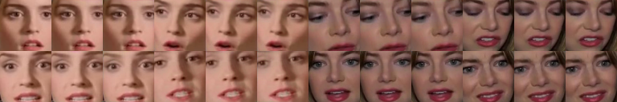

**Маски:**


**Результаты реконструкции:**

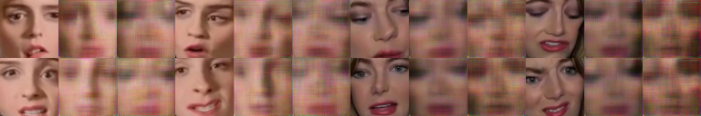
---

### Результаты при `TOTAL_ITERS == 2400`

```
gan_training = mixup_LSGAN
use_PL = True
PL_before_activ = True
use_mask_hinge_loss = False
m_mask = 0.0
lr_factor = 0.1
use_cyclic_loss = False
----------
[iter 2400] Loss_DA: 0.540074 Loss_DB: 0.448063 Loss_GA: 4.129317 Loss_GB: 4.794902 time: 1094.320224
----------
Детали потерь генератора:
[Adversarial loss]
GA: 0.0827 GB: 0.0997
[Reconstruction loss]
GA: 2.6014 GB: 3.2079
[Edge loss]
GA: 0.7070 GB: 0.7063
[Perceptual loss]
GA: 0.3626 GB: 0.4052
----------
```

**Преобразованные (замаскированные) результаты:**

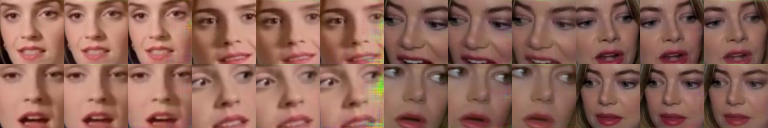

**Маски:**

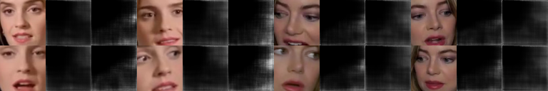

**Результаты реконструкции:**

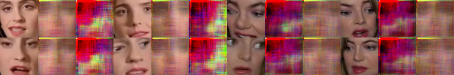
---

### Результаты при `TOTAL_ITERS == 2700`

```
use_PL = True
PL_before_activ = True
use_mask_hinge_loss = False
m_mask = 0.0
lr_factor = 0.1
use_cyclic_loss = False
----------
[iter 2700] Loss_DA: 0.508296 Loss_DB: 0.479599 Loss_GA: 2.252450 Loss_GB: 2.934893 time: 1541.613315
----------
Детали потерь генератора:
[Adversarial loss]
GA: 0.0645 GB: 0.0783
[Reconstruction loss]
GA: 0.9959 GB: 1.4495
[Edge loss]
GA: 0.5557 GB: 0.6678
[Perceptual loss]
GA: 0.2787 GB: 0.3814
----------
```

**Преобразованные (замаскированные) результаты:**

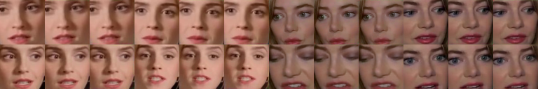

**Маски:**

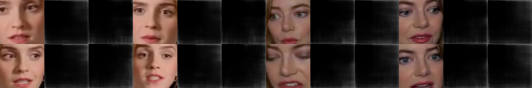

**Результаты реконструкции:**

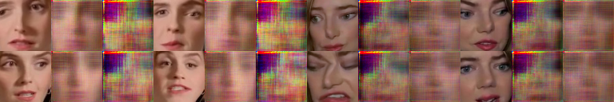
---

### Результаты при `TOTAL_ITERS == 3000`

```
gan_training = mixup_LSGAN
use_PL = True
PL_before_activ = True
use_mask_hinge_loss = True
m_mask = 0.1
lr_factor = 0.3
use_cyclic_loss = False
----------
[iter 3000] Loss_DA: 0.531261 Loss_DB: 0.556841 Loss_GA: 2.172398 Loss_GB: 2.467547 time: 452.021384
----------
Детали потерь генератора:
[Adversarial loss]
GA: 0.0627 GB: 0.0674
[Reconstruction loss]
GA: 0.9593 GB: 1.1184
[Edge loss]
GA: 0.5416 GB: 0.5950
[Perceptual loss]
GA: 0.2673 GB: 0.3436
----------
```

**Преобразованные (замаскированные) результаты:**

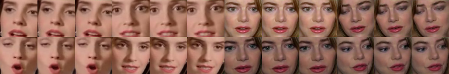

**Маски:**


**Результаты реконструкции:**


---

### Результаты при `TOTAL_ITERS == 3600`

```
gan_training = mixup_LSGAN
use_PL = True
PL_before_activ = True
use_mask_hinge_loss = False
m_mask = 0.0
lr_factor = 0.1
use_cyclic_loss = False
----------
[iter 3600] Loss_DA: 0.483967 Loss_DB: 0.481389 Loss_GA: 1.977065 Loss_GB: 1.904427 time: 1436.592861
----------
Детали потерь генератора:
[Adversarial loss]
GA: 0.0680 GB: 0.0577
[Reconstruction loss]
GA: 0.8415 GB: 0.7528
[Edge loss]
GA: 0.5222 GB: 0.5095
[Perceptual loss]
GA: 0.2352 GB: 0.2741
----------
```

**Преобразованные (замаскированные) результаты:**

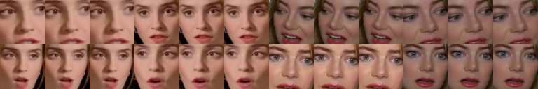

**Маски:**

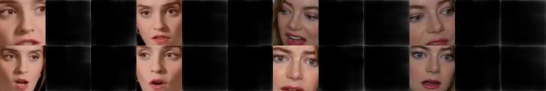
---

**Результаты реконструкции:**

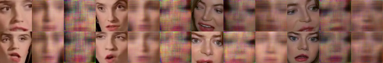
---

### Результаты при `TOTAL_ITERS == 4500`

```
gan_training = mixup_LSGAN
use_PL = True
PL_before_activ = True
use_mask_hinge_loss = False
m_mask = 0.0
lr_factor = 0.1
use_cyclic_loss = False
----------
[iter 4500] Loss_DA: 0.481880 Loss_DB: 0.482069 Loss_GA: 1.912463 Loss_GB: 1.811617 time: 1248.973801
----------
Детали потерь генератора:
[Adversarial loss]
GA: 0.0617 GB: 0.0715
[Reconstruction loss]
GA: 0.7989 GB: 0.6904
[Edge loss]
GA: 0.5175 GB: 0.4949
[Perceptual loss]
GA: 0.2390 GB: 0.2593
----------
```

**Преобразованные (замаскированные) результаты:**

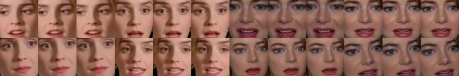

**Маски:**

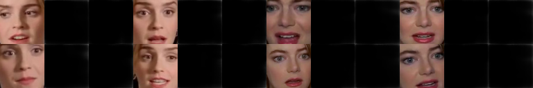

**Результаты реконструкции:**

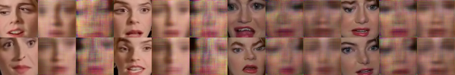
---


### Результаты при `TOTAL_ITERS == 5400`

```
gan_training = mixup_LSGAN
use_PL = True
PL_before_activ = True
use_mask_hinge_loss = True
m_mask = 0.1
lr_factor = 0.3
use_cyclic_loss = False
----------
[iter 5400] Loss_DA: 0.506444 Loss_DB: 0.500950 Loss_GA: 1.902206 Loss_GB: 1.810955 time: 1256.538114
----------
Детали потерь генератора:
[Adversarial loss]
GA: 0.0705 GB: 0.0681
[Reconstruction loss]
GA: 0.7949 GB: 0.7043
[Edge loss]
GA: 0.5222 GB: 0.5001
[Perceptual loss]
GA: 0.2286 GB: 0.2491
----------
```

**Преобразованные (замаскированные) результаты:**

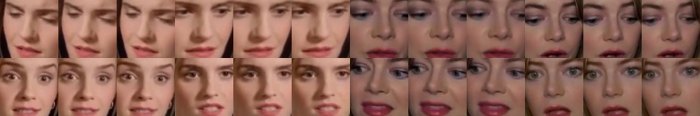

**Маски:**


**Результаты реконструкции:**

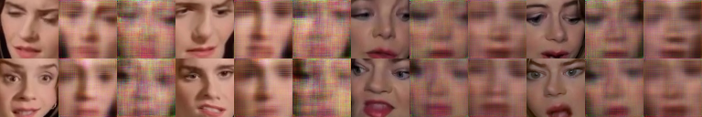
---

### Результаты при `TOTAL_ITERS == 6300`

```
gan_training = mixup_LSGAN
use_PL = True
PL_before_activ = True
use_mask_hinge_loss = False
m_mask = 0.0
lr_factor = 0.1
use_cyclic_loss = False
----------
[iter 6300] Loss_DA: 0.464894 Loss_DB: 0.431720 Loss_GA: 1.774032 Loss_GB: 1.690868 time: 2515.198356
----------
Детали потерь генератора:
[Adversarial loss]
GA: 0.0544 GB: 0.0808
[Reconstruction loss]
GA: 0.7178 GB: 0.6203
[Edge loss]
GA: 0.5125 GB: 0.4867
[Perceptual loss]
GA: 0.2158 GB: 0.2298
----------
```

**Преобразованные (замаскированные) результаты:**

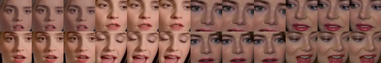

**Маски:**

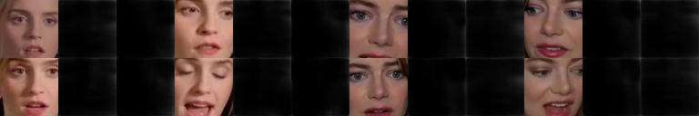

**Результаты реконструкции:**

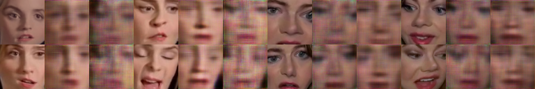
---

### Результаты при `TOTAL_ITERS == 6600`

```
gan_training = mixup_LSGAN
use_PL = True
PL_before_activ = True
use_mask_hinge_loss = False
m_mask = 0.0
lr_factor = 0.1
use_cyclic_loss = False
----------
[iter 6600] Loss_DA: 0.448383 Loss_DB: 0.442061 Loss_GA: 1.765384 Loss_GB: 1.673413 time: 451.966603
----------
Детали потерь генератора:
[Adversarial loss]
GA: 0.0595 GB: 0.0768
[Reconstruction loss]
GA: 0.7105 GB: 0.6110
[Edge loss]
GA: 0.5133 GB: 0.4839
[Perceptual loss]
GA: 0.2115 GB: 0.2313
----------
```

**Преобразованные (замаскированные) результаты:**

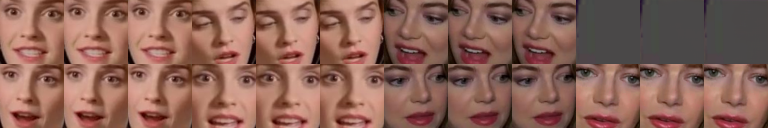

**Маски:**

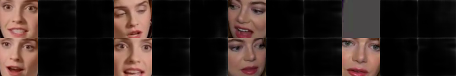

**Результаты реконструкции:**

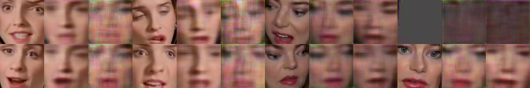
---

### Результаты при `TOTAL_ITERS == 7200`

```
gan_training = mixup_LSGAN
use_PL = True
PL_before_activ = True
use_mask_hinge_loss = False
m_mask = 0.0
lr_factor = 0.1
use_cyclic_loss = False
----------
[iter 7200] Loss_DA: 0.434579 Loss_DB: 0.387956 Loss_GA: 1.740890 Loss_GB: 1.654479 time: 1245.999069
----------
Детали потерь генератора:
[Adversarial loss]
GA: 0.0619 GB: 0.0771
[Reconstruction loss]
GA: 0.6958 GB: 0.6007
[Edge loss]
GA: 0.5107 GB: 0.4787
[Perceptual loss]
GA: 0.2043 GB: 0.2299
----------
```

**Преобразованные (замаскированные) результаты:**

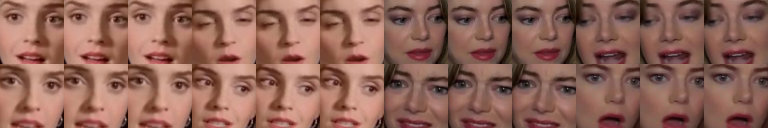

**Маски:**

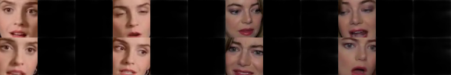

**Результаты реконструкции:**


---
