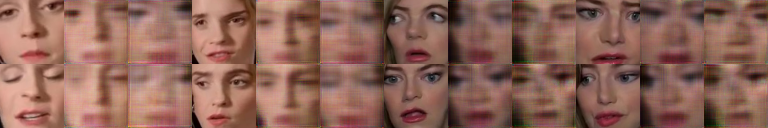
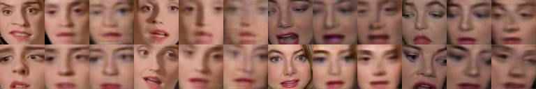
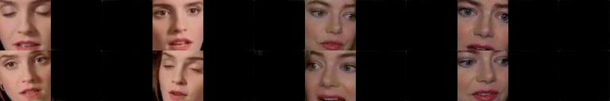
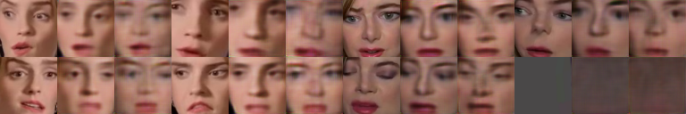
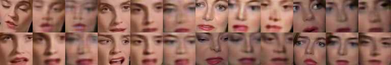
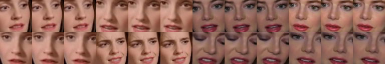
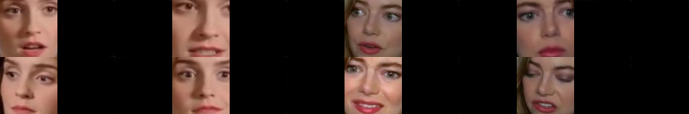
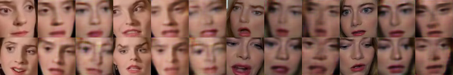

## Обучение GAN моделей на Google Colab

Суть обучения в GAN: конкуренция между генеративной и дискриминативной сетями, где первая пытается 
сгенерировать ложные данные на основе множества реальных данных, а вторая доказать, что сгенерированные 
данные ложные. Таким образом эти сети обучают друг друга до определенной оптимальной точки равновесия.


График потерь:


Ниже представлены результаты обучения моделей для различных этапов итераций при использовании GPU.  

### Результаты при `TOTAL_ITERS == 1500`

**Конфигурация**
```
gan_training = mixup_LSGAN
use_PL = True
PL_before_activ = True
use_mask_hinge_loss = False
m_mask = 0.0
lr_factor = 0.1
use_cyclic_loss = False
```

**Потери**
```
Loss_DA: 0.514674 Loss_DB: 0.573655 
Loss_GA: 2.045384 Loss_GB: 1.867255
time: 658.915660
###################################
[Adversarial loss]
GA: 0.0715 GB: 0.0715
[Reconstruction loss]
GA: 0.8642 GB: 0.7406
[Edge loss]
GA: 0.5377 GB: 0.4928
[Perceptual loss]
GA: 0.2616 GB: 0.2521
```


**Преобразованные результаты:**


**Маски:**


**Результаты реконструкции:**


---


### Результаты при `TOTAL_ITERS == 2400`

**Конфигурация**
```
gan_training = mixup_LSGAN
use_PL = True
PL_before_activ = True
use_mask_hinge_loss = False
m_mask = 0.0
lr_factor = 0.1
use_cyclic_loss = False
```

**Потери**
```
Loss_DA: 0.540074 Loss_DB: 0.448063
Loss_GA: 4.129317 Loss_GB: 4.794902
time: 1094.320224
###################################
[Adversarial loss]
GA: 0.0827 GB: 0.0997
[Reconstruction loss]
GA: 2.6014 GB: 3.2079
[Edge loss]
GA: 0.7070 GB: 0.7063
[Perceptual loss]
GA: 0.3626 GB: 0.4052
```

**Преобразованные результаты:**


**Маски:**


**Результаты реконструкции:**


---


### Результаты при `TOTAL_ITERS == 2700`

**Конфигурация**
```
use_PL = True
PL_before_activ = True
use_mask_hinge_loss = False
m_mask = 0.0
lr_factor = 0.1
use_cyclic_loss = False
```

**Потери**
```
Loss_DA: 0.508296 Loss_DB: 0.479599
Loss_GA: 2.252450 Loss_GB: 2.934893
time: 1541.613315
###################################
[Adversarial loss]
GA: 0.0645 GB: 0.0783
[Reconstruction loss]
GA: 0.9959 GB: 1.4495
[Edge loss]
GA: 0.5557 GB: 0.6678
[Perceptual loss]
GA: 0.2787 GB: 0.3814
```

**Преобразованные результаты:**


**Маски:**


**Результаты реконструкции:**


---


### Результаты при `TOTAL_ITERS == 3000`

**Конфигурация**
```
gan_training = mixup_LSGAN
use_PL = True
PL_before_activ = True
use_mask_hinge_loss = True
m_mask = 0.1
lr_factor = 0.3
use_cyclic_loss = False
```

**Потери**
```
Loss_DA: 0.531261 Loss_DB: 0.556841
Loss_GA: 2.172398 Loss_GB: 2.467547
time: 452.021384
###################################
[Adversarial loss]
GA: 0.0627 GB: 0.0674
[Reconstruction loss]
GA: 0.9593 GB: 1.1184
[Edge loss]
GA: 0.5416 GB: 0.5950
[Perceptual loss]
GA: 0.2673 GB: 0.3436
```

**Преобразованные результаты:**


**Маски:**


**Результаты реконструкции:**


---


### Результаты при `TOTAL_ITERS == 3600`

**Конфигурация**
```
gan_training = mixup_LSGAN
use_PL = True
PL_before_activ = True
use_mask_hinge_loss = False
m_mask = 0.0
lr_factor = 0.1
use_cyclic_loss = False
```

**Потери**
```
Loss_DA: 0.483967 Loss_DB: 0.481389
Loss_GA: 1.977065 Loss_GB: 1.904427
time: 1436.592861
###################################
[Adversarial loss]
GA: 0.0680 GB: 0.0577
[Reconstruction loss]
GA: 0.8415 GB: 0.7528
[Edge loss]
GA: 0.5222 GB: 0.5095
[Perceptual loss]
GA: 0.2352 GB: 0.2741
```

**Преобразованные результаты:**


**Маски:**


**Результаты реконструкции:**


---


### Результаты при `TOTAL_ITERS == 4500`

**Конфигурация**
```
gan_training = mixup_LSGAN
use_PL = True
PL_before_activ = True
use_mask_hinge_loss = False
m_mask = 0.0
lr_factor = 0.1
use_cyclic_loss = False
```

**Потери**
```
Loss_DA: 0.481880 Loss_DB: 0.482069
Loss_GA: 1.912463 Loss_GB: 1.811617
time: 1248.973801
###################################
[Adversarial loss]
GA: 0.0617 GB: 0.0715
[Reconstruction loss]
GA: 0.7989 GB: 0.6904
[Edge loss]
GA: 0.5175 GB: 0.4949
[Perceptual loss]
GA: 0.2390 GB: 0.2593
```

**Преобразованные результаты:**


**Маски:**


**Результаты реконструкции:**


---


### Результаты при `TOTAL_ITERS == 5400`

**Конфигурация**
```
gan_training = mixup_LSGAN
use_PL = True
PL_before_activ = True
use_mask_hinge_loss = True
m_mask = 0.1
lr_factor = 0.3
use_cyclic_loss = False
```

**Потери**
```
Loss_DA: 0.506444 Loss_DB: 0.500950
Loss_GA: 1.902206 Loss_GB: 1.810955
time: 1256.538114
###################################
[Adversarial loss]
GA: 0.0705 GB: 0.0681
[Reconstruction loss]
GA: 0.7949 GB: 0.7043
[Edge loss]
GA: 0.5222 GB: 0.5001
[Perceptual loss]
GA: 0.2286 GB: 0.2491
```

**Преобразованные результаты:**


**Маски:**


**Результаты реконструкции:**


---


### Результаты при `TOTAL_ITERS == 6300`

**Конфигурация**
```
gan_training = mixup_LSGAN
use_PL = True
PL_before_activ = True
use_mask_hinge_loss = False
m_mask = 0.0
lr_factor = 0.1
use_cyclic_loss = False
```

**Потери**
```
Loss_DA: 0.464894 Loss_DB: 0.431720
Loss_GA: 1.774032 Loss_GB: 1.690868
time: 2515.198356
###################################
[Adversarial loss]
GA: 0.0544 GB: 0.0808
[Reconstruction loss]
GA: 0.7178 GB: 0.6203
[Edge loss]
GA: 0.5125 GB: 0.4867
[Perceptual loss]
GA: 0.2158 GB: 0.2298
```

**Преобразованные результаты:**


**Маски:**


**Результаты реконструкции:**


---


### Результаты при `TOTAL_ITERS == 6600`

**Конфигурация**
```
gan_training = mixup_LSGAN
use_PL = True
PL_before_activ = True
use_mask_hinge_loss = False
m_mask = 0.0
lr_factor = 0.1
use_cyclic_loss = False
```

**Потери**
```
Loss_DA: 0.448383 Loss_DB: 0.442061
Loss_GA: 1.765384 Loss_GB: 1.673413
time: 451.966603
###################################
[Adversarial loss]
GA: 0.0595 GB: 0.0768
[Reconstruction loss]
GA: 0.7105 GB: 0.6110
[Edge loss]
GA: 0.5133 GB: 0.4839
[Perceptual loss]
GA: 0.2115 GB: 0.2313
```

**Преобразованные результаты:**


**Маски:**


**Результаты реконструкции:**


---


### Результаты при `TOTAL_ITERS == 7200`

**Конфигурация**
```
gan_training = mixup_LSGAN
use_PL = True
PL_before_activ = True
use_mask_hinge_loss = False
m_mask = 0.0
lr_factor = 0.1
use_cyclic_loss = False
```

**Потери**
```
Loss_DA: 0.434579 Loss_DB: 0.387956
Loss_GA: 1.740890 Loss_GB: 1.654479
time: 1245.999069
###################################
[Adversarial loss]
GA: 0.0619 GB: 0.0771
[Reconstruction loss]
GA: 0.6958 GB: 0.6007
[Edge loss]
GA: 0.5107 GB: 0.4787
[Perceptual loss]
GA: 0.2043 GB: 0.2299
```

**Преобразованные результаты:**


**Маски:**


**Результаты реконструкции:**


---


### Результаты при `TOTAL_ITERS == 7500`

**Конфигурация**
```
gan_training = mixup_LSGAN
use_PL = False
PL_before_activ = True
use_mask_hinge_loss = False
m_mask = 0.0
lr_factor = 1.0
use_cyclic_loss = False
```

**Потери**
```
Loss_DA: 0.839142 Loss_DB: 0.694074
Loss_GA: 5.173245 Loss_GB: 5.005033
time: 248.381829
###################################
[Adversarial loss]
GA: 0.1474 GB: 0.1853
[Reconstruction loss]
GA: 3.8974 GB: 3.7577
[Edge loss]
GA: 0.7406 GB: 0.6674
```

**Преобразованные результаты:**


**Маски:**


**Результаты реконструкции:**


---


### Результаты при `TOTAL_ITERS == 7800`

**Конфигурация**
```
gan_training = mixup_LSGAN
use_PL = False
PL_before_activ = True
use_mask_hinge_loss = False
m_mask = 0.0
lr_factor = 1.0
use_cyclic_loss = False
```

**Потери**
```
Loss_DA: 0.596030 Loss_DB: 0.635119
Loss_GA: 2.626710 Loss_GB: 2.808618
time: 542.005994
###################################
[Adversarial loss]
GA: 0.0735 GB: 0.0809
[Reconstruction loss]
GA: 1.5497 GB: 1.7554
[Edge loss]
GA: 0.6414 GB: 0.6095
```

**Преобразованные результаты:**


**Маски:**


**Результаты реконструкции:**


---


### Результаты при `TOTAL_ITERS == 8100`

**Конфигурация**
```
gan_training = mixup_LSGAN
use_PL = False
PL_before_activ = True
use_mask_hinge_loss = False
m_mask = 0.0
lr_factor = 1.0
use_cyclic_loss = False
```

**Потери**
```
Loss_DA: 0.559468 Loss_DB: 0.575194
Loss_GA: 1.841623 Loss_GB: 1.638523
time: 782.489541
###################################
[Adversarial loss]
GA: 0.0601 GB: 0.0646
[Reconstruction loss]
GA: 0.9100 GB: 0.7431
[Edge loss]
GA: 0.5310 GB: 0.4895
```

**Преобразованные результаты:**


**Маски:**


**Результаты реконструкции:**


---


### Результаты при `TOTAL_ITERS == 8400`

**Конфигурация**
```
gan_training = mixup_LSGAN
use_PL = False
PL_before_activ = True
use_mask_hinge_loss = False
m_mask = 0.0
lr_factor = 1.0
use_cyclic_loss = False
```

**Потери**
```
Loss_DA: 0.520927 Loss_DB: 0.550475
Loss_GA: 1.730066 Loss_GB: 1.539704
time: 242.015981
###################################
[Adversarial loss]
GA: 0.0577 GB: 0.0570
[Reconstruction loss]
GA: 0.8278 GB: 0.6777
[Edge loss]
GA: 0.5200 GB: 0.4801
```

**Преобразованные результаты:**


**Маски:**


**Результаты реконструкции:**


---


### Результаты при `TOTAL_ITERS == 8700`

**Конфигурация**
```
gan_training = mixup_LSGAN
use_PL = False
PL_before_activ = True
use_mask_hinge_loss = False
m_mask = 0.0
lr_factor = 1.0
use_cyclic_loss = False
```

**Потери**
```
Loss_DA: 0.535666 Loss_DB: 0.529484
Loss_GA: 1.669019 Loss_GB: 1.501582
time: 481.647984
###################################
[Adversarial loss]
GA: 0.0618 GB: 0.0653
[Reconstruction loss]
GA: 0.7758 GB: 0.6472
[Edge loss]
GA: 0.5190 GB: 0.4763
```

**Преобразованные результаты:**


**Маски:**


**Результаты реконструкции:**


---


### Результаты при `TOTAL_ITERS == 9000`

**Конфигурация**
```
gan_training = mixup_LSGAN
use_PL = False
PL_before_activ = True
use_mask_hinge_loss = False
m_mask = 0.0
lr_factor = 1.0
use_cyclic_loss = False
```

**Потери**
```
Loss_DA: 0.529432 Loss_DB: 0.538524
Loss_GA: 1.603102 Loss_GB: 1.451406
time: 721.774360
###################################
[Adversarial loss]
GA: 0.0528 GB: 0.0628
[Reconstruction loss]
GA: 0.7372 GB: 0.6194
[Edge loss]
GA: 0.5132 GB: 0.4690
```

**Преобразованные результаты:**


**Маски:**


**Результаты реконструкции:**



---


### Результаты при `TOTAL_ITERS == 9300`

**Конфигурация**
```
gan_training = mixup_LSGAN
use_PL = False
PL_before_activ = True
use_mask_hinge_loss = False
m_mask = 0.0
lr_factor = 1.0
use_cyclic_loss = False
```

**Потери**
```
Loss_DA: 0.509900 Loss_DB: 0.498977
Loss_GA: 1.569144 Loss_GB: 1.415831
time: 240.789467
###################################
[Adversarial loss]
GA: 0.0652 GB: 0.0600
[Reconstruction loss]
GA: 0.7089 GB: 0.6041
[Edge loss]
GA: 0.5085 GB: 0.4648
```

**Преобразованные результаты:**


**Маски:**


**Результаты реконструкции:**


---


### Результаты при `TOTAL_ITERS == 9600`

**Конфигурация**
```
gan_training = mixup_LSGAN
use_PL = True
PL_before_activ = True
use_mask_hinge_loss = True
m_mask = 0.1
lr_factor = 0.3
use_cyclic_loss = False
```

**Потери**
```
time: 634.296397
Loss_DA: 0.519989 Loss_DB: 0.494129
Loss_GA: 1.610754 Loss_GB: 1.493527
###################################
```

**Преобразованные результаты:**


**Маски:**


**Результаты реконструкции:**


---


### Результаты при `TOTAL_ITERS == 9900`

**Конфигурация**
```
gan_training = mixup_LSGAN
use_PL = True
PL_before_activ = True
use_mask_hinge_loss = True
m_mask = 0.1
lr_factor = 0.3
use_cyclic_loss = False
```

**Потери**
```
time: 1077.759794
Loss_DA: 0.473192 Loss_DB: 0.484349
Loss_GA: 1.664971 Loss_GB: 1.532372
###################################
[Adversarial loss]
GA: 0.0590 GB: 0.0608
[Reconstruction loss]
GA: 0.6321 GB: 0.5496
[Edge loss]
GA: 0.4940 GB: 0.4520
[Perceptual loss]
GA: 0.2148 GB: 0.2094
```

**Преобразованные результаты:**


**Маски:**


**Результаты реконструкции:**


---


### Результаты при `TOTAL_ITERS == 10200`

**Конфигурация**
```
gan_training = mixup_LSGAN
use_PL = True
PL_before_activ = True
use_mask_hinge_loss = True
m_mask = 0.1
lr_factor = 0.3
use_cyclic_loss = False
```

**Потери**
```
Loss_DA: 0.480185 Loss_DB: 0.477147
Loss_GA: 1.615242 Loss_GB: 1.492713
time: 1429.053756
###################################
[Adversarial loss]
GA: 0.0510 GB: 0.0570
[Reconstruction loss]
GA: 0.6250 GB: 0.5344
[Edge loss]
GA: 0.4904 GB: 0.4483
[Perceptual loss]
GA: 0.1984 GB: 0.2053
```

**Преобразованные результаты:**


**Маски:**


**Результаты реконструкции:**


---


### Результаты при `TOTAL_ITERS == 10500`

**Конфигурация**
```
gan_training = mixup_LSGAN
use_PL = True
PL_before_activ = True
use_mask_hinge_loss = True
m_mask = 0.1
lr_factor = 0.3
use_cyclic_loss = False
```

**Потери**
```
Loss_DA: 0.493245 Loss_DB: 0.478978
Loss_GA: 1.614942 Loss_GB: 1.492770
time: 1779.929239
###################################
[Adversarial loss]
GA: 0.0615 GB: 0.0587
[Reconstruction loss]
GA: 0.6204 GB: 0.5372
[Edge loss]
GA: 0.4900 GB: 0.4514
[Perceptual loss]
GA: 0.2008 GB: 0.2038
```

**Преобразованные результаты:**


**Маски:**


**Результаты реконструкции:**


---


### Результаты при `TOTAL_ITERS == 10800`

**Конфигурация**
```
gan_training = mixup_LSGAN
use_PL = True
PL_before_activ = True
use_mask_hinge_loss = False
m_mask = 0.0
lr_factor = 0.1
use_cyclic_loss = False
```

**Потери**
```
Loss_DA: 0.474124 Loss_DB: 0.453900
Loss_GA: 1.552783 Loss_GB: 1.471773
time: 2229.397242
###################################
[Adversarial loss]
GA: 0.0509 GB: 0.0594
[Reconstruction loss]
GA: 0.5945 GB: 0.5269
[Edge loss]
GA: 0.4800 GB: 0.4496
[Perceptual loss]
GA: 0.1897 GB: 0.1984
```

**Преобразованные результаты:**


**Маски:**


**Результаты реконструкции:**


---


### Результаты при `TOTAL_ITERS == 11100`

**Конфигурация**
```
use_PL = True
PL_before_activ = True
use_mask_hinge_loss = False
m_mask = 0.0
lr_factor = 0.1
use_cyclic_loss = False
```

**Потери**
```
Loss_DA: 0.447175 Loss_DB: 0.441961
Loss_GA: 1.550866 Loss_GB: 1.452151
time: 2674.923751
###################################
[Adversarial loss]
GA: 0.0581 GB: 0.0579
[Reconstruction loss]
GA: 0.5888 GB: 0.5133
[Edge loss]
GA: 0.4791 GB: 0.4486
[Perceptual loss]
GA: 0.1903 GB: 0.1976
```

**Преобразованные результаты:**


**Маски:**


**Результаты реконструкции:**


---


### Результаты при `TOTAL_ITERS == 11400`

**Конфигурация**
```
gan_training = mixup_LSGAN
use_PL = True
PL_before_activ = True
use_mask_hinge_loss = False
m_mask = 0.0
lr_factor = 0.1
use_cyclic_loss = False
```

**Потери**
```
Loss_DA: 0.447001 Loss_DB: 0.444914
Loss_GA: 1.545801 Loss_GB: 1.453469
time: 3029.775087
###################################
[Adversarial loss]
GA: 0.0579 GB: 0.0672
[Reconstruction loss]
GA: 0.5863 GB: 0.5107
[Edge loss]
GA: 0.4781 GB: 0.4448
[Perceptual loss]
GA: 0.1910 GB: 0.1980
```

**Преобразованные результаты:**


**Маски:**


**Результаты реконструкции:**


---


### Результаты при `TOTAL_ITERS == 11700`

**Конфигурация**
```
gan_training = mixup_LSGAN
use_PL = True
PL_before_activ = True
use_mask_hinge_loss = False
m_mask = 0.0
lr_factor = 0.1
use_cyclic_loss = False
```

**Потери**
```
Loss_DA: 0.446816 Loss_DB: 0.438983
Loss_GA: 1.537943 Loss_GB: 1.437740
time: 3382.525349
###################################
[Adversarial loss]
GA: 0.0621 GB: 0.0666
[Reconstruction loss]
GA: 0.5767 GB: 0.5039
[Edge loss]
GA: 0.4755 GB: 0.4421
[Perceptual loss]
GA: 0.1927 GB: 0.1939
```

**Преобразованные результаты:**


**Маски:**


**Результаты реконструкции:**


---


### Результаты при `TOTAL_ITERS == 12000`

**Конфигурация**
```
gan_training = mixup_LSGAN
use_PL = True
PL_before_activ = True
use_mask_hinge_loss = False
m_mask = 0.0
lr_factor = 0.1
use_cyclic_loss = False
```

**Потери**
```
Loss_DA 0.439080 Loss_DB 0.424603
Loss_GA 1.537667 Loss_GB 1.438472
time 3735.587453
###################################
[Adversarial loss]
GA 0.0616 GB 0.0624
[Reconstruction loss]
GA 0.5790 GB 0.5059
[Edge loss]
GA 0.4762 GB 0.4467
[Perceptual loss]
GA 0.1912 GB 0.1936
```

**Преобразованные результаты:**


**Маски:**


**Результаты реконструкции:**


---


### Результаты при `TOTAL_ITERS == 12300`

**Конфигурация**
```
gan_training = mixup_LSGAN
use_PL = True
PL_before_activ = True
use_mask_hinge_loss = False
m_mask = 0.0
lr_factor = 0.1
use_cyclic_loss = False
```

**Потери**
```
Loss_DA: 0.454731 Loss_DB: 0.429335
Loss_GA: 1.514982 Loss_GB: 1.435907
time: 357.660995
###################################
[Adversarial loss]
GA: 0.0518 GB: 0.0684
[Reconstruction loss]
GA: 0.5755 GB: 0.5045
[Edge loss]
GA: 0.4732 GB: 0.4423
[Perceptual loss]
GA: 0.1869 GB: 0.1928
```

**Преобразованные результаты:**


**Маски:**


**Результаты реконструкции:**


---


### Результаты при `TOTAL_ITERS == 12600`

**Конфигурация**
```
gan_training = mixup_LSGAN
use_PL = True
PL_before_activ = True
use_mask_hinge_loss = False
m_mask = 0.0
lr_factor = 0.1
use_cyclic_loss = False
```

**Потери**
```
Loss_DA: 0.431794 Loss_DB: 0.432173
Loss_GA: 1.518062 Loss_GB: 1.411945
time: 712.588538
###################################
[Adversarial loss]
GA: 0.0637 GB: 0.0626
[Reconstruction loss]
GA: 0.5673 GB: 0.4925
[Edge loss]
GA: 0.4687 GB: 0.4383
[Perceptual loss]
GA: 0.1910 GB: 0.1908
```

**Преобразованные результаты:**


**Маски:**


**Результаты реконструкции:**


---


### Результаты при `TOTAL_ITERS == 12900`

**Конфигурация**
```
gan_training = mixup_LSGAN
use_PL = True
PL_before_activ = True
use_mask_hinge_loss = False
m_mask = 0.0
lr_factor = 0.1
use_cyclic_loss = False
```

**Потери**
```
Loss_DA: 0.446200 Loss_DB: 0.430632
Loss_GA: 1.508153 Loss_GB: 1.420149
time: 1067.499015
###################################
[Adversarial loss]
GA: 0.0585 GB: 0.0603
[Reconstruction loss]
GA: 0.5697 GB: 0.4976
[Edge loss]
GA: 0.4692 GB: 0.4443
[Perceptual loss]
GA: 0.1844 GB: 0.1912
```

**Преобразованные результаты:**


**Маски:**


**Результаты реконструкции:**


---


### Результаты при `TOTAL_ITERS == 13200`

**Конфигурация**
```
gan_training = mixup_LSGAN
use_PL = True
PL_before_activ = True
use_mask_hinge_loss = False
m_mask = 0.0
lr_factor = 0.1
use_cyclic_loss = False
```

**Потери**
```
Loss_DA: 0.449993 Loss_DB: 0.443759
Loss_GA: 1.497055 Loss_GB: 1.395447
time: 1421.272730
###################################
[Adversarial loss]
GA: 0.0592 GB: 0.0600
[Reconstruction loss]
GA: 0.5634 GB: 0.4875
[Edge loss]
GA: 0.4667 GB: 0.4346
[Perceptual loss]
GA: 0.1822 GB: 0.1874
```

**Преобразованные результаты:**


**Маски:**


**Результаты реконструкции:**


---


### Результаты при `TOTAL_ITERS == 13500`

**Конфигурация**
```
gan_training = mixup_LSGAN
use_PL = True
PL_before_activ = True
use_mask_hinge_loss = False
m_mask = 0.0
lr_factor = 0.1
use_cyclic_loss = False
```

**Потери**
```
Loss_DA: 0.433541 Loss_DB: 0.434626
Loss_GA: 1.509865 Loss_GB: 1.396048
time: 1876.694255
###################################
[Adversarial loss]
GA: 0.0613 GB: 0.0615
[Reconstruction loss]
GA: 0.5676 GB: 0.4854
[Edge loss]
GA: 0.4689 GB: 0.4369
[Perceptual loss]
GA: 0.1875 GB: 0.1872
```

**Преобразованные результаты:**


**Маски:**


**Результаты реконструкции:**


---


### Результаты при `TOTAL_ITERS == 13800`

**Конфигурация**
```
gan_training = mixup_LSGAN
use_PL = True
PL_before_activ = True
use_mask_hinge_loss = False
m_mask = 0.0
lr_factor = 0.1
use_cyclic_loss = False
```

**Потери**
```
Loss_DA: 0.426215 Loss_DB: 0.425567
Loss_GA: 1.487803 Loss_GB: 1.409408
time: 2318.688081
###################################
[Adversarial loss]
GA: 0.0533 GB: 0.0626
[Reconstruction loss]
GA: 0.5600 GB: 0.4895
[Edge loss]
GA: 0.4671 GB: 0.4420
[Perceptual loss]
GA: 0.1838 GB: 0.1912
```

**Преобразованные результаты:**


**Маски:**


**Результаты реконструкции:**


---


### Результаты при `TOTAL_ITERS == 14100`

**Конфигурация**
```
gan_training = mixup_LSGAN
use_PL = True
PL_before_activ = True
use_mask_hinge_loss = False
m_mask = 0.0
lr_factor = 0.1
use_cyclic_loss = False
```

**Потери**
```
Loss_DA: 0.440622 Loss_DB: 0.422074
Loss_GA: 1.494821 Loss_GB: 1.392103
time: 2673.394961
###################################
[Adversarial loss]
GA: 0.0625 GB: 0.0661
[Reconstruction loss]
GA: 0.5617 GB: 0.4821
[Edge loss]
GA: 0.4659 GB: 0.4349
[Perceptual loss]
GA: 0.1819 GB: 0.1857
```

**Преобразованные результаты:**


**Маски:**


**Результаты реконструкции:**


---


### Результаты при `TOTAL_ITERS == 14400`

**Конфигурация**
```
gan_training = mixup_LSGAN
use_PL = True
PL_before_activ = True
use_mask_hinge_loss = False
m_mask = 0.0
lr_factor = 0.1
use_cyclic_loss = False
```

**Потери**
```
Loss_DA: 0.396572 Loss_DB: 0.415056
Loss_GA: 1.480977 Loss_GB: 1.392838
time: 3027.518703
###################################
[Adversarial loss]
GA: 0.0516 GB: 0.0666
[Reconstruction loss]
GA: 0.5565 GB: 0.4788
[Edge loss]
GA: 0.4639 GB: 0.4373
[Perceptual loss]
GA: 0.1869 GB: 0.1876
```

**Преобразованные результаты:**


**Маски:**


**Результаты реконструкции:**


---


### Результаты при `TOTAL_ITERS == 14700`

**Конфигурация**
```
gan_training = mixup_LSGAN
use_PL = True
PL_before_activ = True
use_mask_hinge_loss = False
m_mask = 0.0
lr_factor = 0.1
use_cyclic_loss = False
```

**Потери**
```
Loss_DA: 0.431082 Loss_DB: 0.412533
Loss_GA: 1.483494 Loss_GB: 1.395753
time: 3380.408743
###################################
[Adversarial loss]
GA: 0.0624 GB: 0.0648
[Reconstruction loss]
GA: 0.5564 GB: 0.4812
[Edge loss]
GA: 0.4626 GB: 0.4378
[Perceptual loss]
GA: 0.1805 GB: 0.1900
```

**Преобразованные результаты:**


**Маски:**


**Результаты реконструкции:**


---


### Результаты при `TOTAL_ITERS == 15000`

**Конфигурация**
```
gan_training = mixup_LSGAN
use_PL = True
PL_before_activ = True
use_mask_hinge_loss = False
m_mask = 0.0
lr_factor = 0.1
use_cyclic_loss = False
```

**Потери**
```
Loss_DA: 0.439065 Loss_DB: 0.434197
Loss_GA: 1.493636 Loss_GB: 1.408838
time: 3732.785540
###################################
[Adversarial loss]
GA: 0.0671 GB: 0.0712
[Reconstruction loss]
GA: 0.5558 GB: 0.4830
[Edge loss]
GA: 0.4655 GB: 0.4418
[Perceptual loss]
GA: 0.1843 GB: 0.1917
```

**Преобразованные результаты:**


**Маски:**


**Результаты реконструкции:**


---


### Результаты при `TOTAL_ITERS == 15300`

**Конфигурация**
```
gan_training = mixup_LSGAN
use_PL = True
PL_before_activ = True
use_mask_hinge_loss = False
m_mask = 0.0
lr_factor = 0.1
use_cyclic_loss = False
```

**Потери**
```
Loss_DA: 0.412702 Loss_DB: 0.410472
Loss_GA: 1.479280 Loss_GB: 1.385256
time: 362.367125
###################################
[Adversarial loss]
GA: 0.0698 GB: 0.0620
[Reconstruction loss]
GA: 0.5503 GB: 0.4779
[Edge loss]
GA: 0.4604 GB: 0.4376
[Perceptual loss]
GA: 0.1792 GB: 0.1877
```

**Преобразованные результаты:**


**Маски:**


**Результаты реконструкции:**


---


### Результаты при `TOTAL_ITERS == 15600`

**Конфигурация**
```
gan_training = mixup_LSGAN
use_PL = True
PL_before_activ = True
use_mask_hinge_loss = False
m_mask = 0.0
lr_factor = 0.1
use_cyclic_loss = False
```

**Потери**
```
Loss_DA: 0.416541 Loss_DB: 0.411377
Loss_GA: 1.482659 Loss_GB: 1.383309
time: 720.620565
###################################
[Adversarial loss]
GA: 0.0672 GB: 0.0680
[Reconstruction loss]
GA: 0.5508 GB: 0.4750
[Edge loss]
GA: 0.4617 GB: 0.4369
[Perceptual loss]
GA: 0.1832 GB: 0.1833
```

**Преобразованные результаты:**


**Маски:**


**Результаты реконструкции:**


---


### Результаты при `TOTAL_ITERS == 15900`

**Конфигурация**
```
gan_training = mixup_LSGAN
use_PL = True
PL_before_activ = True
use_mask_hinge_loss = False
m_mask = 0.0
lr_factor = 0.1
use_cyclic_loss = False
```

**Потери**
```
Loss_DA: 0.420276 Loss_DB: 0.415374
Loss_GA: 1.483100 Loss_GB: 1.374697
time: 1075.511749
###################################
[Adversarial loss]
GA: 0.0681 GB: 0.0684
[Reconstruction loss]
GA: 0.5497 GB: 0.4690
[Edge loss]
GA: 0.4617 GB: 0.4335
[Perceptual loss]
GA: 0.1843 GB: 0.1842
```

**Преобразованные результаты:**


**Маски:**


**Результаты реконструкции:**


---


### Результаты при `TOTAL_ITERS == 16200`

**Конфигурация**
```
gan_training = mixup_LSGAN
use_PL = True
PL_before_activ = True
use_mask_hinge_loss = False
m_mask = 0.0
lr_factor = 0.1
use_cyclic_loss = False
```

**Потери**
```
Loss_DA: 0.420023 Loss_DB: 0.430146
Loss_GA: 1.467462 Loss_GB: 1.372205
time: 1540.367519
###################################
[Adversarial loss]
GA: 0.0663 GB: 0.0642
[Reconstruction loss]
GA: 0.5450 GB: 0.4703
[Edge loss]
GA: 0.4580 GB: 0.4356
[Perceptual loss]
GA: 0.1794 GB: 0.1829
```

**Преобразованные результаты:**


**Маски:**


**Результаты реконструкции:**



---


### Результаты при `TOTAL_ITERS == 16500`

**Конфигурация**
```
gan_training = mixup_LSGAN
use_PL = True
PL_before_activ = True
use_mask_hinge_loss = False
m_mask = 0.0
lr_factor = 0.1
use_cyclic_loss = False
```

**Потери**
```
Loss_DA: 0.405364 Loss_DB: 0.403956
Loss_GA: 1.459409 Loss_GB: 1.363534
time: 1982.312864
###################################
[Adversarial loss]
GA: 0.0637 GB: 0.0677
[Reconstruction loss]
GA: 0.5402 GB: 0.4652
[Edge loss]
GA: 0.4549 GB: 0.4328
[Perceptual loss]
GA: 0.1825 GB: 0.1792
```

**Преобразованные результаты:**


**Маски:**


**Результаты реконструкции:**


---


### Результаты при `TOTAL_ITERS == 16800`

**Конфигурация**
```
gan_training = mixup_LSGAN
use_PL = True
PL_before_activ = True
use_mask_hinge_loss = False
m_mask = 0.0
lr_factor = 0.1
use_cyclic_loss = False
```

**Потери**
```
Loss_DA: 0.414046 Loss_DB: 0.420759
Loss_GA: 1.472670 Loss_GB: 1.370027
time: 2333.537089
###################################
[Adversarial loss]
GA: 0.0627 GB: 0.0722
[Reconstruction loss]
GA: 0.5490 GB: 0.4651
[Edge loss]
GA: 0.4616 GB: 0.4322
[Perceptual loss]
GA: 0.1817 GB: 0.1824
```

**Преобразованные результаты:**


**Маски:**


**Результаты реконструкции:**


---


### Результаты при `TOTAL_ITERS == 17100`

**Конфигурация**
```
gan_training = mixup_LSGAN
use_PL = True
PL_before_activ = True
use_mask_hinge_loss = False
m_mask = 0.0
lr_factor = 0.1
use_cyclic_loss = False
```

**Потери**
```
Loss_DA: 0.404190 Loss_DB: 0.384709
Loss_GA: 1.468952 Loss_GB: 1.352262
time: 2687.170997
###################################
[Adversarial loss]
GA: 0.0703 GB: 0.0584
[Reconstruction loss]
GA: 0.5438 GB: 0.4638
[Edge loss]
GA: 0.4600 GB: 0.4309
[Perceptual loss]
GA: 0.1776 GB: 0.1815
```

**Преобразованные результаты:**


**Маски:**



**Результаты реконструкции:**


---


### Результаты при `TOTAL_ITERS == 17400`

**Конфигурация**
```
gan_training = mixup_LSGAN
use_PL = True
PL_before_activ = True
use_mask_hinge_loss = False
m_mask = 0.0
lr_factor = 0.1
use_cyclic_loss = False
```

**Потери**
```
Loss_DA: 0.414237 Loss_DB: 0.405600
Loss_GA: 1.456933 Loss_GB: 1.361373
time: 3040.477145
###################################
[Adversarial loss]
GA: 0.0644 GB: 0.0669
[Reconstruction loss]
GA: 0.5409 GB: 0.4607
[Edge loss]
GA: 0.4570 GB: 0.4324
[Perceptual loss]
GA: 0.1778 GB: 0.1840
```

**Преобразованные результаты:**


**Маски:**


**Результаты реконструкции:**


---


### Результаты при `TOTAL_ITERS == 17700`

**Конфигурация**
```
gan_training = mixup_LSGAN
use_PL = True
PL_before_activ = True
use_mask_hinge_loss = False
m_mask = 0.0
lr_factor = 0.1
use_cyclic_loss = False
```

**Потери**
```
Loss_DA: 0.405012 Loss_DB: 0.397205
Loss_GA: 1.463782 Loss_GB: 1.357612
time: 3394.875125
###################################
[Adversarial loss]
GA: 0.0685 GB: 0.0676
[Reconstruction loss]
GA: 0.5420 GB: 0.4598
[Edge loss]
GA: 0.4574 GB: 0.4316
[Perceptual loss]
GA: 0.1794 GB: 0.1818
```

**Преобразованные результаты:**


**Маски:**


**Результаты реконструкции:**



---


### Результаты при `TOTAL_ITERS == 18000`

**Конфигурация**
```
gan_training = mixup_LSGAN
use_PL = True
PL_before_activ = True
use_mask_hinge_loss = False
m_mask = 0.0
lr_factor = 0.1
use_cyclic_loss = False
```

**Потери**
```
Loss_DA: 0.407296 Loss_DB: 0.413828
Loss_GA: 1.468395 Loss_GB: 1.355422
time: 3748.565844
###################################
[Adversarial loss]
GA: 0.0755 GB: 0.0675
[Reconstruction loss]
GA: 0.5403 GB: 0.4588
[Edge loss]
GA: 0.4581 GB: 0.4318
[Perceptual loss]
GA: 0.1785 GB: 0.1810
```

**Преобразованные результаты:**


**Маски:**


**Результаты реконструкции:**


---


### Результаты при `TOTAL_ITERS == 18300`

**Конфигурация**
```
gan_training = mixup_LSGAN
use_PL = True
PL_before_activ = True
use_mask_hinge_loss = False
m_mask = 0.0
lr_factor = 0.1
use_cyclic_loss = False
```

**Потери**
```
Loss_DA: 0.397398 Loss_DB: 0.407949
Loss_GA: 1.444738 Loss_GB: 1.348312
time: 355.298715
###################################
[Adversarial loss]
GA: 0.0678 GB: 0.0662
[Reconstruction loss]
GA: 0.5339 GB: 0.4564
[Edge loss]
GA: 0.4527 GB: 0.4319
[Perceptual loss]
GA: 0.1755 GB: 0.1785
```

**Преобразованные результаты:**


**Маски:**


**Результаты реконструкции:**


---


### Результаты при `TOTAL_ITERS == 18600`

**Конфигурация**
```
gan_training = mixup_LSGAN
use_PL = True
PL_before_activ = True
use_mask_hinge_loss = False
m_mask = 0.0
lr_factor = 0.1
use_cyclic_loss = False
```

**Потери**
```
Loss_DA: 0.403235 Loss_DB: 0.414708
Loss_GA: 1.464434 Loss_GB: 1.354635
time: 708.681302
###################################
[Adversarial loss]
GA: 0.0750 GB: 0.0646
[Reconstruction loss]
GA: 0.5384 GB: 0.4584
[Edge loss]
GA: 0.4572 GB: 0.4354
[Perceptual loss]
GA: 0.1786 GB: 0.1805
```

**Преобразованные результаты:**


**Маски:**


**Результаты реконструкции:**



---


### Результаты при `TOTAL_ITERS == 18900`

**Конфигурация**
```
gan_training = mixup_LSGAN
use_PL = True
PL_before_activ = True
use_mask_hinge_loss = False
m_mask = 0.0
lr_factor = 0.1
use_cyclic_loss = False
```

**Потери**
```
Loss_DA: 0.377730 Loss_DB: 0.419126
Loss_GA: 1.453937 Loss_GB: 1.348876
time: 1164.816249
###################################
[Adversarial loss]
GA: 0.0697 GB: 0.0724
[Reconstruction loss]
GA: 0.5354 GB: 0.4511
[Edge loss]
GA: 0.4579 GB: 0.4299
[Perceptual loss]
GA: 0.1761 GB: 0.1802
```

**Преобразованные результаты:**


**Маски:**


**Результаты реконструкции:**


---


### Результаты при `TOTAL_ITERS == 19200`

**Конфигурация**
```
gan_training = mixup_LSGAN
use_PL = True
PL_before_activ = True
use_mask_hinge_loss = False
m_mask = 0.0
lr_factor = 0.1
use_cyclic_loss = False
```

**Потери**
```
Loss_DA: 0.381334 Loss_DB: 0.391406
Loss_GA: 1.451179 Loss_GB: 1.352742
time: 1606.797234
###################################
[Adversarial loss]
GA: 0.0723 GB: 0.0758
[Reconstruction loss]
GA: 0.5302 GB: 0.4515
[Edge loss]
GA: 0.4531 GB: 0.4307
[Perceptual loss]
GA: 0.1812 GB: 0.1798
```

**Преобразованные результаты:**


**Маски:**


**Результаты реконструкции:**


---


### Результаты при `TOTAL_ITERS == 19500`

**Конфигурация**
```
gan_training = mixup_LSGAN
use_PL = True
PL_before_activ = True
use_mask_hinge_loss = False
m_mask = 0.0
lr_factor = 0.1
use_cyclic_loss = False
```

**Потери**
```
Loss_DA: 0.394081 Loss_DB: 0.399700
Loss_GA: 1.449869 Loss_GB: 1.352455
time: 1959.791666
###################################
[Adversarial loss]
GA: 0.0754 GB: 0.0726
[Reconstruction loss]
GA: 0.5327 GB: 0.4526
[Edge loss]
GA: 0.4551 GB: 0.4318
[Perceptual loss]
GA: 0.1726 GB: 0.1809
```

**Преобразованные результаты:**



**Маски:**


**Результаты реконструкции:**


---


### Результаты при `TOTAL_ITERS == 19800`

**Конфигурация**
```
gan_training = mixup_LSGAN
use_PL = True
PL_before_activ = True
use_mask_hinge_loss = False
m_mask = 0.0
lr_factor = 0.1
use_cyclic_loss = False
```

**Потери**
```
Loss_DA: 0.392661 Loss_DB: 0.402290
Loss_GA: 1.460222 Loss_GB: 1.347851
time: 2311.645219
###################################
[Adversarial loss]
GA: 0.0883 GB: 0.0727
[Reconstruction loss]
GA: 0.5286 GB: 0.4495
[Edge loss]
GA: 0.4523 GB: 0.4313
[Perceptual loss]
GA: 0.1773 GB: 0.1803
```

**Преобразованные результаты:**


**Маски:**


**Результаты реконструкции:**


---


### Результаты при `TOTAL_ITERS == 20100`

**Конфигурация**
```
gan_training = mixup_LSGAN
use_PL = True
PL_before_activ = True
use_mask_hinge_loss = False
m_mask = 0.0
lr_factor = 0.1
use_cyclic_loss = False
```

**Потери**
```
Loss_DA: 0.389567 Loss_DB: 0.401551
Loss_GA: 1.442616 Loss_GB: 1.340215
time: 2663.066785
###################################
[Adversarial loss]
GA: 0.0731 GB: 0.0755
[Reconstruction loss]
GA: 0.5288 GB: 0.4465
[Edge loss]
GA: 0.4522 GB: 0.4281
[Perceptual loss]
GA: 0.1751 GB: 0.1763
```

**Преобразованные результаты:**


**Маски:**



**Результаты реконструкции:**


---


### Результаты при `TOTAL_ITERS == 20700`

**Конфигурация**
```
gan_training = mixup_LSGAN
use_PL = True
PL_before_activ = True
use_mask_hinge_loss = False
m_mask = 0.0
lr_factor = 0.1
use_cyclic_loss = False
```

**Потери**
```
Loss_DA: 0.386834 Loss_DB: 0.385435
Loss_GA: 1.445837 Loss_GB: 1.327568
time: 3376.744653
###################################
[Adversarial loss]
GA: 0.0782 GB: 0.0760
[Reconstruction loss]
GA: 0.5251 GB: 0.4388
[Edge loss]
GA: 0.4507 GB: 0.4248
[Perceptual loss]
GA: 0.1792 GB: 0.1748
```

**Преобразованные результаты:**


**Маски:**


**Результаты реконструкции:**



---


### Результаты при `TOTAL_ITERS == 21000`

**Конфигурация**
```
gan_training = mixup_LSGAN
use_PL = True
PL_before_activ = True
use_mask_hinge_loss = False
m_mask = 0.0
lr_factor = 0.1
use_cyclic_loss = False
```

**Потери**
```
Loss_DA: 0.380924 Loss_DB: 0.395754
Loss_GA: 1.455343 Loss_GB: 1.331075
time: 3739.105542
###################################
[Adversarial loss]
GA: 0.0844 GB: 0.0752
[Reconstruction loss]
GA: 0.5289 GB: 0.4390
[Edge loss]
GA: 0.4528 GB: 0.4271
[Perceptual loss]
GA: 0.1769 GB: 0.1768
```

**Преобразованные результаты:**


**Маски:**


**Результаты реконструкции:**


---